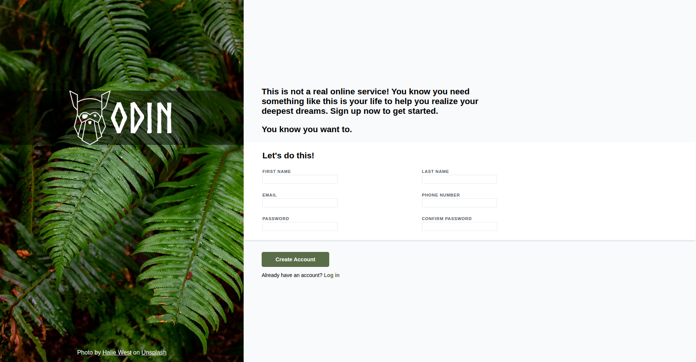

# sign-up-form


## About

A responsive, modern sign-up form built with HTML and CSS. This project emphasizes semantic HTML structure, clean CSS styling, and creating an aesthetically pleasing UI without JavaScript.


## Screenshot


*Desktop view of the sign-up form project*


## Features

- **Semantic HTML:** Proper use of `<form>`, `<input>`, `<label>`, `<fieldset>`, and accessibility attributes.

- **Styled Form Inputs:** Visual feedback with `:focus` and `:invalid` pseudo-classes.

- **Custom Typography & Colors:** Uses a custom font for headings and a harmonious color palette (`#596D48` as the main accent color).

- **Background Overlay:** Semi-transparent overlay for text readability against a full-width background image.

- **Responsive Layout Foundation:** Flexbox-based layout for two main sections (graphics & form).


## Project Structure

```
sign-up-form/
│
├── assets/                                     
│   ├── fonts/                                          # Custom fonts
│   │   └── Norse-Bold.otf          
│   └── images/                                         # Logo and background images
│       ├── background-image.jpg
│       ├── odin-lined-logo.png
|       └── screenshots                                 # Screenshot of webpage
|           └── Screenshot.png
├── css/
│   └── styles.css                                      # CSS styling
├── index.html                                          # Main HTML file
└── README.md                                           # Project documentation

```

## Link

[sign-up-form](https://nishadnp.github.io/sign-up-form/)


## Potential Improvements

- Add JavaScript validation for password matching and real-time feedback.

- Improve mobile responsiveness for small devices.

- Add animations or transitions for enhanced user experience.